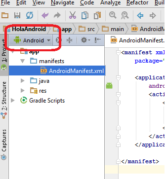

# Creación de un proyecto en Android Studio

##Objetivo
Desarrollar una aplicación android.

##Objetivos Específicos

1. Crear la interfaz gráfica de la aplicación:
  * Layout
  * Menú
  * Recursos **Strings**
  * Diálogos
  * Vistas personalizadas.
2. Crear un **Activity**.
3. Asignar una vista al **Activity**
4. Aplicar los métodos básicos para iniciar **Activities**
5. Desplegar notificaciones básicas.
6. Implementar acciones de la interfaz gráfica.

A continuación se describen los pasos para crear un proyecto básico en **Android Studio** (el código completo se encuentra en [este enlace](https://github.com/dgonzalez870/HolaAndroid.git)).

1. Ejecutar **Android Studio**
2. En el panel **Quick Start** seleccionar **Start a new Android Studio project**.
3. En **Application name** colocar **Hola Android**.
4. En Company domain colocar cualquier nombre, por ejemplo **miDominio**.
5. Editar **Package name** y colocar **com.prueba.holaAndroid** y hacer click en **Next**.
6. En el siguiente diálogo dejar marcada la opción **Phone and Tablet** y seleccionar Minimun SDK API 10: Android 2.3 (Gingerbread).
7. Seleccionar **Add no Activity** y click sobre **Finish**

8. En el explorador del proyecto, ubicado en la parte izquierda de la pantalla, en vista modo **Android**, ir al nodo **app>manifest>AndroidManifest.xml**.



La vista del archivo debe ser la siguiente:
```xml
<manifest xmlns:android="http://schemas.android.com/apk/res/android"
    package="com.prueba.holaAndroid">

    <application android:allowBackup="true" android:label="@string/app_name"
        android:icon="@mipmap/ic_launcher" android:theme="@style/AppTheme">

    </application>

</manifest>
```
Se puede observar en el archivo xml un nodo con el nombre **application** dentro del cual serán declarados los distintos componentes de la aplicación. En el nodo **manifest** se observa el atributo **package** que hace referencia al nombre del paquete que hemos indicado anteriormente.
###<a name="creaLayout"> Creación de un Layout</a>

Un **layout** es una clase que describe los componentes de la interfaz gráfica de la aplicación, el layout puede ser editado en una vista de diseño provista por **Android Studio**, directamente sobre el código XML ó creado a través del código **java** (el desarrollo del layout en XML es el recomendado porque facilita el diseño y permite separar el código y la presentación). Android tiene predefinidos un conjunto de layouts que sirven de padres a los demás elementos de la interfaz gráfica, se pueden mencionar los siguientes:

1. [**LinearLayout**](http://developer.android.com/reference/android/widget/LinearLayout.html): Es una clase que organiza sus hijos en una dirección única (horizontal o vertical). Los hijos aparecen en pantalla en el orden en el que son cargados en el layout.
2. [**RelativeLayout**](http://developer.android.com/reference/android/widget/RelativeLayout.html): Es una clase que organiza la posición de sus hijos en relación a la posición relativa entre ellos y el propio padre.
3. [**FrameLayout**](http://developer.android.com/reference/android/widget/FrameLayout.html): Generalmente se utiliza para cargar una visa única en una sección de la pantalla, de esta manera se evita que se superpongan las vistas con cambios en la orientación y el tamaño de la pantalla del dispositivo, sin embargo el **FrameLayout** soporta la inclusión de múltiples vistas.
4. [**TableLayout**](https://developer.android.com/guide/topics/ui/layout/grid.html): Es una clase que permite organizar a sus hijos como filas y columnas de una tabla.

Pasos para crear un **layout**

9. En vista modo **Android** hacer click derecho sobre **app>res** y seleccionar **New>XML>Layout XML File**.
10. En **Layout File Name** colocar **layout_main** y en **Root Tag** dejar **Linear Layout**. Al hacer click en **Finish** se abrirá una vista de diseño.
11. En el nodo **Widgets** en la parte izquierda de la pantalla arrastrar un elemeto del tipo **Plain TextView** hacia la vista del dispositivo.
12. Seleccionar el elemento añadido y en el panel **Properties** en la parte derecha de la pantalla editar las siguientes propiedades:
  * layout:width= match_parent
  * gravity=center
  * text=Hola Android.
  * testSize=40sp.
13. Hacer click sobre la pestaña **Text** en la parte inferior izquierda del panel.


El resultado del código XML debe ser el siguiente:
```xml
<?xml version="1.0" encoding="utf-8"?>
<LinearLayout xmlns:android="http://schemas.android.com/apk/res/android"
    android:layout_width="match_parent" android:layout_height="wrap_content"
    android:gravity="center">

    <TextView
        android:layout_width="wrap_content"
        android:layout_height="wrap_content"
        android:text="Hola Android"
        android:id="@+id/textView"
        android:textStyle="bold"
        android:textSize="40sp" />

</LinearLayout>
```

### Creación de un Activity (Actividad).

Un **Activity** (Actividad) es el principal componente de una aplicación **Android**. Es una **clase Java** que provee el funcionamiento de la interfaz gráfica. a continuación se describe el procedimiento para crear un Activity de cero, es decir, sin el uso de las plantillas provistas por **Android Studio**.

1. En vista modo **Android** hacer click derecho sobre **app>java>com.prueba.holaAndroid** y seleccionar **New>Java Class**
2. En el nombre de la clase colocar **MainActivity**.
3. Convertir la clase en una subclase de la clase **Activity**.
4. Asegurarse de que esté presente el siguiente import: `import android.app.Activity;`
```java
package com.prueba.holaAndroid;

import android.app.Activity;

public class MainActivity extends Activity{
}
```
#### Implemetar el primer método del Activity

El **Activity** al ser iniciado ejecuta automáticamente un conjunto de métodos conocidos como los métodos de l ciclo de vida. En el método `onCreate(Bundle savedInstanceState)` se asigna la vista al **Activiti** 

1. Ir a la barra de menúes **Code>Override Methods...**, de la lista que se despliega seleccionar **onCreate(Bundle savedInstanceState)**.
2. Escribir la siguiente instrucción: `setContentView(R.layout.layout_main)`, con esa instrucción se le dice al **Activity** que la vista será la del layout que se ha creado en los pasos anteriores. la vista del código en este paso es la siguiente:

```java
package com.prueba.holaAndroid;

import android.app.Activity;
import android.os.Bundle;

public class MainActivity extends Activity{
    @Override
    protected void onCreate(Bundle savedInstanceState) {
        super.onCreate(savedInstanceState);
        setContentView(R.layout.layout_main);
    }
}
```

`R.layout.layout_main` hace referencia a un recurso del tipo **layout** para el cual se crea un identificador en el archivo **R.java**

#### Declarar el Activity en el Manifiesto

Hasta este punto se ha creado un **Activity**, en la aplicación **Android** los **Activities** deben ser declarados como componentes de aplicación en el manifiesto. 

***

**NOTA:** Si se crea el Activity utilizando algunas de las plantillas provistas por el IDE Android Studio es declarado automáticamente en el archivo **AndroidManifest.xml**.

***

1. Abrir el archivo AndroidManifest.xml
2. En el nodo **application** añadir lo siguiente: `<activity android:name=".MainActivity"></activity>`.
3. En el nodo **activity** añadir el siguiente elemento: `<intent-filter></intent-filter>`.
4. En el nodo **intent-filter** añadir el siguiente elemento: `<action android:name="android.intent.action.MAIN"/>`
5. En el nodo **intent-filter** añadir el siguiente elemento: `<category android:name="android.intent.category.LAUNCHER"/>`

El código debe ser el siguiente

```xml
<manifest xmlns:android="http://schemas.android.com/apk/res/android"
    package="com.prueba.holaAndroid">

    <application android:allowBackup="true" android:label="@string/app_name"
        android:icon="@mipmap/ic_launcher" android:theme="@style/AppTheme">
        <activity android:name=".MainActivity">
            <intent-filter>
                <action android:name="android.intent.action.MAIN"/>
                <category android:name="android.intent.category.LAUNCHER"/>
            </intent-filter>
        </activity>
    </application>

</manifest>
```
Con los pasos anteriores se ha declarado el **Activity** como un componente de la aplicación en el manifiesto y además se le ha dado los atributos para ser el punto de entrada de la aplicación. En este punto la aplicación ya puede ser instalada y ejecutada en un dispositivo. Una vez que la aplicación se ejecute este Activty será lo primero que se despliegue en la pantalla.
<a href="emulador.md">
<p align="right">Siguiente: Configuración del Emulador</p></a>


